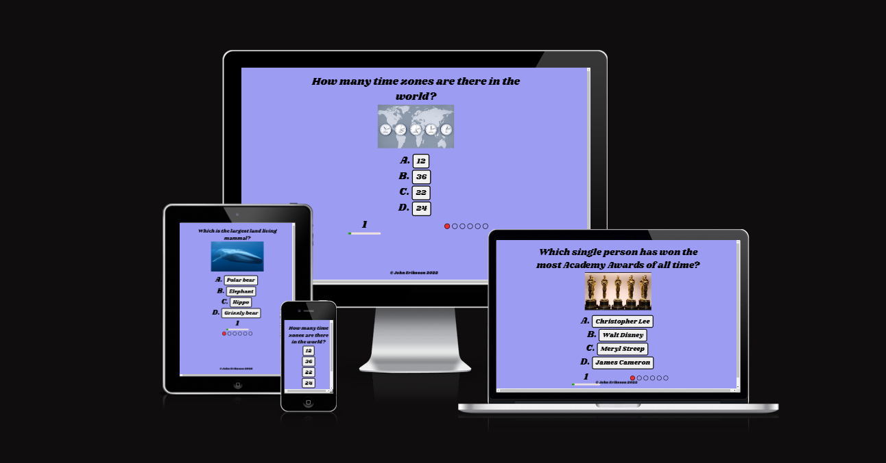
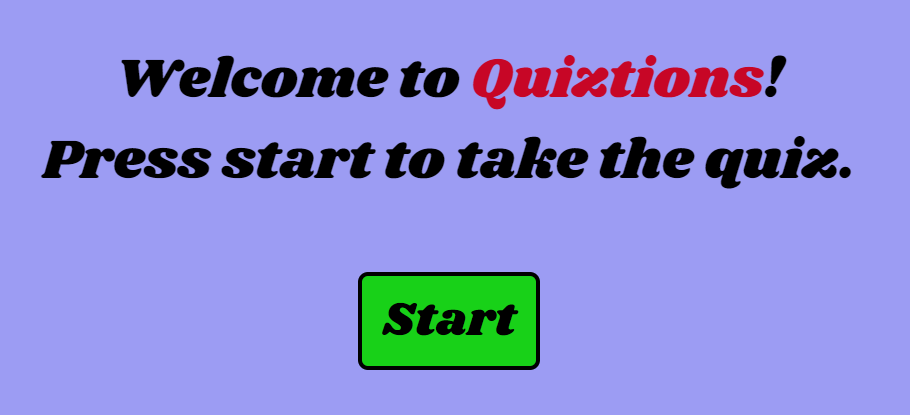
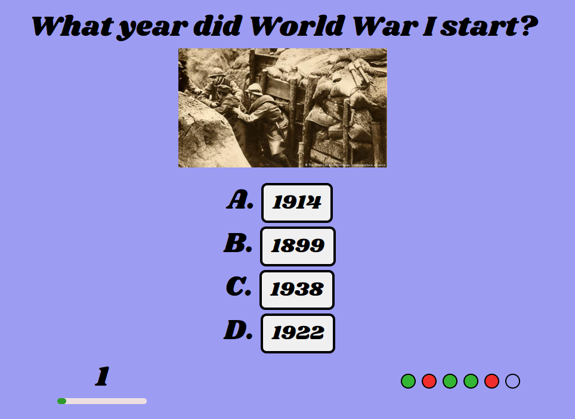
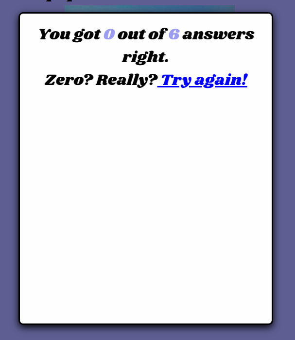

# Quiztions - a quiz app

Quiztions in a simple quiz application designed to test the users in general knowledge. It's a fully responsive little JavaScript game made for people who want to test their knowledge in a broad sense, no categories. When finished the user gets a score and a short message grading them.

## Features 

### Existing Features

- __Starting Page__

  - The starting page welcomes the user to the game. A button to start the game is shown.

- __The Quiz Page__

  - This page shows the quiz game. The user will be able to easily see the question, a corresponding image (not on mobile) and the four answers they can chose from. A timer and progress bar is shown on the bottom.

- __The Question section__

  - The question will pop up here. The order of the questions are randomized. 

- __The image section__

  - For every question there is a corresponding image that shows under the question.
  - The image is not shown in smaller screen widths in order for the user not having to scroll mid question.

- __The answer section__

  - This section has four answer buttons prefixed with A, B, C and D (not prefixed on mobile). When the user clicks a button a function is called that checks if it's the correct answer.

- __The timer__

  - At the bottom left there is a timer that counts down from 10 seconds for every question. If no answer is clicked before the timer runs out the user automatically gets an incorrect answer for that question and the next one is shown.

- __The progress bar__

  - At the bottom right there is a progress bar with one circle for every question. The circle will turn green/red depending on a correct/incorrect answer for every question. Here the user can see where they answered right or wrong. 

- __The score screen__
  
  - When all the questions are answered, a score screen pops up that says how many answers the user got correct and a short grading message.
  - The user can click the link "Try again!" to retake the quiz.

### Features Left to Implement

- Randomize the order of the answers
- High scores with user names
- At the end, show the user which questions they got wrong and what the correct answer was
- More questions

## Testing 

In this section, you need to convince the assessor that you have conducted enough testing to legitimately believe that the site works well. Essentially, in this part you will want to go over all of your project’s features and ensure that they all work as intended, with the project providing an easy and straightforward way for the users to achieve their goals.

In addition, you should mention in this section how your project looks and works on different browsers and screen sizes.

You should also mention in this section any interesting bugs or problems you discovered during your testing, even if you haven't addressed them yet.

If this section grows too long, you may want to split it off into a separate file and link to it from here.

### Validator Testing 

The W3C Markup Validator and W3C CSS Validator Services were used to validate every page of the project to ensure there were no syntax errors in the project.

- HTML
    - No errors were returned when passing through the official [W3C validator](https://validator.w3.org/nu/?doc=https%3A%2F%2Fjohneriksson88.github.io%2Fquiz-app%2Fgame.html)
- CSS
    - No errors were found when passing through the official [(Jigsaw) validator](https://jigsaw.w3.org/css-validator/validator?uri=https%3A%2F%2Fjohneriksson88.github.io%2Fquiz-app%2Fgame.html&profile=css3svg&usermedium=all&warning=1&vextwarning=&lang=sv)
- JavaScript
    - No errors were found when passing through the official [Jshint validator](https://jshint.com/)
      - The following metrics were returned: 
      - There are 10 functions in this file.
      - Function with the largest signature take 1 arguments, while the median is 0.
      - Largest function has 14 statements in it, while the median is 3.5.
      - The most complex function has a cyclomatic complexity value of 7 while the median is 1.5.

### Unfixed Bugs

At the moment there are no known bugs in the application.

## Deployment

- The site was deployed to GitHub pages. The steps to deploy are as follows: 
  - In the GitHub repository, navigate to the Settings tab 
  - From the source section drop-down menu, select the Master Branch
  - Once the master branch has been selected, the page will be automatically refreshed with a detailed ribbon display to indicate the successful deployment. 

The live link can be found here - https://johneriksson88.github.io/quiz-app/index.html

## Credits 

In this section you need to reference where you got your content, media and extra help from. It is common practice to use code from other repositories and tutorials, however, it is important to be very specific about these sources to avoid plagiarism. 

You can break the credits section up into Content and Media, depending on what you have included in your project. 

### Content 

- All text and questions were written by me
- Instructions on how to create a quiz app were mainly taken from [this](https://www.youtube.com/watch?v=49pYIMygIcU&ab_channel=CodeExplained) video tutorial by YouTube user Code Explained
- The GitHub repo of the tutorial can be found [here](https://github.com/CodeExplainedRepo/Multiple-Choice-Quiz-JavaScript)
- Code that was directly derived from this tutorial is credited in comments in the JavaScript-file
- Another helpful video tutorial was [this](https://www.youtube.com/watch?v=riDzcEQbX6k&t=1216s&ab_channel=WebDevSimplified) one from YouTube user Web Dev Simplified

### Media

- The images were found on google images and the credits are as follows:
  - Academy awards: MATT SAYLES/A.M.P.A.S. VIA GETTY IMAGES
  - Blue whale: Mike Johnson
  - Tokyo skyline: https://livejapan.com/en/article-a0001580/ - photographer not mentioned
  - Australian flag: Vector graphics image by Ian Fieggen
  - Time zone clocks: artpartner-images / Getty Images
  - WWI trench: (C) The print Collector/Heritage Images/picture alliance

## Other General Project Advice

Below you will find a couple of extra tips that may be helpful when completing your project. Remember that each of these projects will become part of your final portfolio so it’s important to allow enough time to showcase your best work! 

- One of the most basic elements of keeping a healthy commit history is with the commit message. When getting started with your project, read through [this article](https://chris.beams.io/posts/git-commit/) by Chris Beams on How to Write  a Git Commit Message 
  - Make sure to keep the messages in the imperative mood 

- When naming the files in your project directory, make sure to consider meaningful naming of files, point to specific names and sections of content.
  - For example, instead of naming an image used ‘image1.png’ consider naming it ‘landing_page_img.png’. This will ensure that there are clear file paths kept. 

- Do some extra research on good and bad coding practices, there are a handful of useful articles to read, consider reviewing the following list when getting started:
  - [Writing Your Best Code](https://learn.shayhowe.com/html-css/writing-your-best-code/)
  - [HTML & CSS Coding Best Practices](https://medium.com/@inceptiondj.info/html-css-coding-best-practice-fadb9870a00f)
  - [Google HTML/CSS Style Guide](https://google.github.io/styleguide/htmlcssguide.html#General)

Getting started with your Portfolio Projects can be daunting, planning your project can make it a lot easier to tackle, take small steps to reach the final outcome and enjoy the process! 